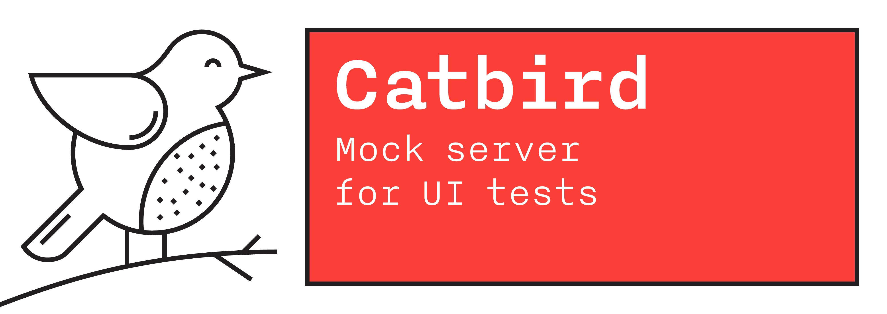

# Catbird

[](https://github.com/RedMadRobot/catbird/actions/workflows/test.yml)
[](https://github.com/RedMadRobot/Catbird/blob/master/LICENSE)
[](https://cocoapods.org/pods/Catbird)
[](https://cocoapods.org/pods/Catbird)
[](https://swift.org/package-manager)



## Features

- Dynamic mock server
- Static file mock server
- Proxy server with writing response files

## Installation

To use Catbird in UI-tests you must have Catbird server and Catbird API code which allows you to communicate with the server.

| Type | Server | API code |
| ---- | ------ | -------- |
| Manual    | ✅ | ✅ |
| Homebrew  | ✅ | 🚫 |
| SPM       | 🚫 | ✅ |
| CocoaPods | ✅ | ✅ |

### Manual

Download [catbird.zip](https://github.com/RedMadRobot/catbird/releases/latest/download/catbird.zip) archive from the [latest release](https://github.com/RedMadRobot/catbird/releases/latest) page.

### Using [Homebrew](http://brew.sh/):

Run the following command:

```
brew install RedMadRobot/formulae/catbird
```

### Using [SPM](https://www.swift.org/package-manager/):

If you have an Xcode project, open it and add Catbird Package using the following URL:

`https://github.com/RedMadRobot/catbird.git`

### Using [CocoaPods](https://cocoapods.org):

Add `Catbird` to UI tests target.

```ruby
target 'App' do
  use_frameworks!

  target 'AppUITests' do
    inherit! :search_paths

    pod 'Catbird'
  end
end
```

## Setup in Xcode project

- Open `Schema/Edit scheme...`
- Select Test action
- Select `Pre-Actions`
  - Add `New Run Script action`
  - Provide build setting from `<YOUR_APP_TARGET>`
  - `${PODS_ROOT}/Catbird/start.sh`
- Select `Post-Actions`
  - Add `New Run Script action`
  - Provide build setting from `<YOUR_APP_TARGET>`
  - `${PODS_ROOT}/Catbird/stop.sh`

## Usage

```swift
import XCTest
import Catbird

enum LoginMock: CatbirdMockConvertible {
    case success
    case blockedUserError

    var pattern: RequestPattern {
        RequestPattern(method: .POST, url: URL(string: "/login")!)
    }

    var response: ResponseMock {
        switch self {
        case .success:
            let json: [String: Any] = [
                "data": [
                    "access_token": "abc",
                    "refresh_token": "xyz",
                    "expired_in": "123",
                ]
            ]
            return ResponseMock(
                status: 200,
                headers: ["Content-Type": "application/json"],
                body: try! JSONSerialization.data(withJSONObject: json))

        case .blockedUserError:
            let json: [String: Any] = [
                "error": [
                    "code": "user_blocked",
                    "message": "user blocked"
                ]
            ]
            return ResponseMock(
                status: 400,
                headers: ["Content-Type": "application/json"],
                body: try! JSONSerialization.data(withJSONObject: json))
        }
    }
}

final class LoginUITests: XCTestCase {

    private let catbird = Catbird()
    private var app: XCUIApplication!

    override func setUp() {
        super.setUp()
        continueAfterFailure = false
        app = XCUIApplication()

        // Base URL in app `UserDefaults.standard.url(forKey: "url_key")`
        app.launchArguments = ["-url_key", catbird.url.absoluteString]
        app.launch()
    }

    override func tearDown() {
        XCTAssertNoThrow(try catbird.send(.removeAll), "Remove all requests")
        super.tearDown()
    }

    func testLogin() {
        XCTAssertNoThrow(try catbird.send(.add(LoginMock.success)))

        app.textFields["login"].tap()
        app.textFields["login"].typeText("john@example.com")
        app.secureTextFields["password"].tap()
        app.secureTextFields["password"].typeText("qwerty")
        app.buttons["Done"].tap()

        XCTAssert(app.staticTexts["Main Screen"].waitForExistence(timeout: 3))
    }

    func testBlockedUserError() {
        XCTAssertNoThrow(try catbird.send(.add(LoginMock.blockedUserError)))

        app.textFields["login"].tap()
        app.textFields["login"].typeText("peter@example.com")
        app.secureTextFields["password"].tap()
        app.secureTextFields["password"].typeText("burger")
        app.buttons["Done"].tap()

        XCTAssert(app.alerts["Error"].waitForExistence(timeout: 3))
    }
}
```

### Request patterns

You can specify a pattern for catch http requests and make a response with mock data. Pattern matching applied for URL and http headers in the request. See `RequestPattern` struct.

Three types of patterns can be used:

- `equal` - the request value must be exactly the same as the pattern value,
- `wildcard` - the request value match with the wildcard pattern (see below),
- `regexp` - the request value match with the regular expression pattern.

##### Note:
If you want to apply a wildcard pattern for the url query parameters, don't forget escape `?` symbol after domain or path.

```swift
Pattern.wildcard("http://example.com\?query=*")
```

### Wildcard pattern

"Wildcards" are the patterns you type when you do stuff like `ls *.js` on the command line, or put `build/*` in a `.gitignore` file.

In our implementation any wildcard pattern translates to regular expression and applies matching with URL or header string.

The following characters have special magic meaning when used in a pattern:

- `*` matches 0 or more characters
- `?` matches 1 character
- `[a-z]` matches a range of characters, similar to a RegExp range.
- `{bar,baz}` matches one of the substitution listed in braces. For example pattern  `foo{bar,baz}` matches strings `foobar` or `foobaz`

You can escape special characters with backslash `\`.

Negation in groups is not supported.


## Example project

```bash
$ cd Example/CatbirdX
$ bundle exec pod install
$ xed .
```

## Environment variables

- `CATBIRD_MOCKS_DIR` — Directory where static mocks are located.
- `CATBIRD_RECORD_MODE` —  set this variable to `1` so that the application starts recording HTTP responses along the path set in `CATBIRD_MOCKS_DIR`. Default `0`.
- `CATBIRD_REDIRECT_URL` — set this url to forward direct requests to catbird. By default, nil. If the recording mode is not enabled, then first the responses will be searched in the mocks and only if nothing is found, the request will be forwarded.
- `CATBIRD_PROXY_ENABLED` — set this variable to `1` to forward proxy requests to catbird. By default, `0`. If the recording mode is not enabled, then first the responses will be searched in the mocks and only if nothing is found, the request will be proxied.

> Catbird supports proxying only HTTP requests. HTTPS requests are not supported!

### Redirect example

Run catbird with `CATBIRD_REDIRECT_URL`.

```bash
CATBIRD_REDIRECT_URL=https://api.github.com ./catbird
```

All direct requests will be forwarded to `CATBIRD_REDIRECT_URL`.

```bash
curl http://127.0.0.1:8080/zen
```

The response will be returned as to the request https://api.github.com/zen

### Proxy example

Run catbird with `CATBIRD_PROXY_ENABLED=1`.

```bash
CATBIRD_PROXY_ENABLED=1 ./catbird
```

All requests will be proxied and redirected to the real host.

```bash
curl http://api.github.com/zen --proxy http://127.0.0.1:8080
```

## Logs

Logs can be viewed in the `Console.app` with subsystem `com.redmadrobot.catbird`

Don't forget to include the message in the action menu

- [x] Include Info Messages
- [x] Include Debug Messages

Without this, only error messages will be visible

## Web

You can view a list of all intercepted requests on the page http://127.0.0.1:8080/catbird

## Parallel testing

For parallel testing you need to fulfill several conditions.

- Create a `Catbird` instance for each test case or test method with a unique `parallelId` identifier.
- Pass `parallelId` to the application.
- Add `parallelId` as **X-Catbird-Parallel-Id** to each request header in application.

```swift
final class LoginUITests: XCTestCase {

    private let catbird = Catbird(parallelId: UUID().uuidString)
    private var app: XCUIApplication!

    override func setUp() {
        super.setUp()
        continueAfterFailure = false
        app = XCUIApplication()

        app.launchArguments = [
            // Base URL in app `UserDefaults.standard.url(forKey: "url_key")`
            "-url_key", catbird.url.absoluteString,

            // `parallelId` in app `UserDefaults.standard.url(forKey: "parallelId")`
            "-parallelId", catbird.parallelId!
        ]
        app.launch()
    }
}
```
